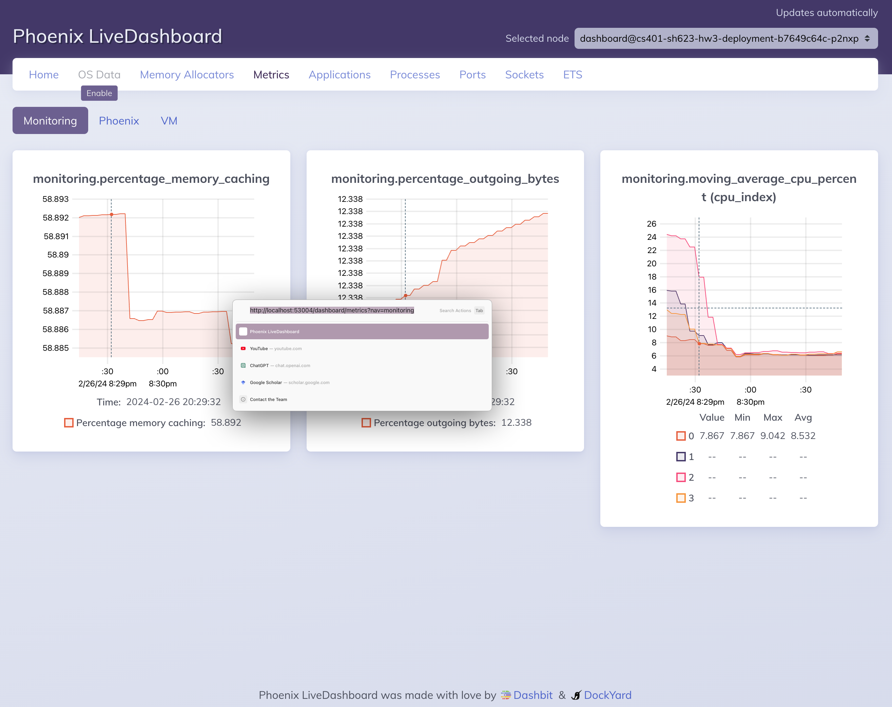

# Project 3: Serverless Computing and Monitoring Dashboard

## Introduction

In this project, I implement a serverless function that computes metrics from
system data, and a monitoring dashboard to display the metrics in real-time.
I also create a serverless runtime compatible with the provided runtime,
but with additional features.

## Task 1: Serverless Function and Runtime

The data is stored in Redis under the `metrics` key.

### Data Output (Computed Metric and Function Results)

My serverless function `function.py` computes two stateless metrics at each
point in time:
the percentage of outgoing traffic bytes under the key
`percentage_outgoing_bytes` and the percentage of memory caching content under
the key `percentage_memory_caching`.

My function also compute a moving average utilization of each CPU over the last
minute under the key `moving_average_cpu_percent-X` (for CPU `X`)
by taking the arithmetic mean of all the CPU utilization percentages within the
last minute as of the last CPU metrics.
This is achieved by storing each CPU's utilization percentages and the
timestamps they are recorded in a list under the key `cpu_percent-X` in
`context.env`.
Statistics more than one minute older than the latest are removed to save
memory.

These keys (`percentage_outgoing_bytes`, `percentage_memory_caching`,
and `moving_average_cpu_percent-X`, totaling $N_{\text{CPU}} + 2$ keys)
are returned from the `handle` function as a JSON-encodable dictionary.

### Integration with the Serverless Framework

I use the image `lucasmsp/serverless:redis` and the deployment files as
provided, without changes. To specify the serverless function,
I create a ConfigMap in `pyfile-cm.yml`, with a single key named `pyfile`,
whose value is my serverless function source code.
I also create another ConfigMap in `outputkey-cm.yml` that contains a single key
named `REDIS_OUTPUT_KEY` corresponding to `sh623-proj3-output` to store my
output in Redis.

I deploy my serverless function by applying my ConfigMaps and the provided
deployment file to my Kubernetes namespace:

```sh
kubectl -n sh623 apply -f outputkey-cm.yml -f pyfile-cm.yml -f serverless-deployment-course.yaml
```

## Task 2: Monitoring Dashboard

To display the monitoring information computed by my serverless function,
I leverage the metrics section of Phoenix web framework's built-in live
dashboard to build `dashboard/`. Specifically,
I poll the Redis server for the metrics every 2.5 seconds,
and [register the metrics as telemetry
events](https://hexdocs.pm/phoenix/telemetry.html#telemetry-events);
in the dashboard's metrics configuration,
I [listen to these
events](https://medium.com/@marcdel/adding-custom-metrics-to-a-phoenix-1-5-live-dashboard-1b21a8df5cf1).
The live dashboard then automatically displays the metrics in real-time as a
line chart.

The Redis server to poll can be specified in the environment variables
`REDIS_HOST` and `REDIS_PORT`,
and the output key can be specified in the environment variable
`REDIS_OUTPUT_KEY`.

### Containerizing The Dashboard and Deployment

I generated the `Dockerfile` using `mix phx.gen.release --docker`,
added a Docker compose file,
[patched the
`Dockerfile`](https://elixirforum.com/t/mix-deps-get-memory-explosion-when-doing-cross-platform-docker-build/57157/3)
so it builds on ARM Macs, and built the image at `dashboard/` with:

```sh
DOCKER_DEFAULT_PLATFORM="linux/amd64" docker compose build
```

The image built is on DockerHub, named `sssstevenhe/cs401-hw3-dashboard`.

The Kubernetes deployment and service specifications are in `dashboard.yml`,
applied with:

```sh
kubectl -n sh623 apply -f dashboard.yml
```

To try out the dashboard, find its IP `<Service IP>`:

```sh
kubectl get services cs401-sh623-hw3-service
```

Then, establish a port-forwarding to the dashboard:

```sh
ssh -L 53004:<Service IP>:53004 <VM name>
```

Finally, visit `http://localhost:53004` in your browser to see the dashboard.
A sample is shown below:



The percentage of memory caching and outgoing traffic bytes are stable,
while the moving average CPU utilization fluctuates, as expected.

## Task 3: Serverless Runtime

The serverless runtime at `runtime/` is a drop-in replacement for the original
runtime, with dependencies managed using [Poetry](https://python-poetry.org/).
The Docker build file is bootstrapped using `docker init` and built using
`docker compose build` like before,
and is largely based on [a comment in a Poetry
issue](https://github.com/orgs/python-poetry/discussions/1879#discussioncomment-7284113).
The image is on DockerHub, named `sssstevenhe/cs401-hw3-runtime`.

Using the deployment file at `runtime-improved.yml`,
I replaced the original deployment with my runtime,
and the serverless function works exactly as before.

### Required Extensions

My runtime and deployment file allow users to specify the following parameters
through a ConfigMap named `runtime-improved`:

- Redis Input Key: My runtime allows the user to configure a different Redis key
    to be monitored by setting the `REDIS_INPUT_KEY` key.
- Redis Monitoring Period:
    My runtime allows the user to configure the period of how frequently the
    Redis key above is monitored by setting the `POLL_INTERVAL_SECONDS` key.
- Complex Function Support:
    My runtime allows the user to supply a ZIP file containing the
    function's code by setting the `zipped-module` key,
    and specifying the function name in `ZIPPED_MODULE_NAME`.
- Function Handler:
    My runtime allows the user to specify what function should be called as the
    "entry point" by setting the `HANDLER_FUNCTION_NAME` key.

Unfortunately, I did not find a way to set the default values for ConfigMaps.
The configMapKeyRefs are set as optional,
so if the users do not specify them,
the default values in the container will be used.
The example ConfigMap is provided in `runtime-improved-cm.yml`,
and includes all available customizations.

#### ZIP File Support

The runtime allows the user to pass in the location of a ZIP file containing the
function's code in the environment variable `FUNCTION_ZIP_PATH`,
and the module name in `ZIPPED_MODULE_NAME` (which can include `.`s).
If `ZIPPED_MODULE_NAME` is not provided,
the runtime switches to loading the function from a file instead,
so it is compatible with Lucas' runtime.

To include a ZIP file in a ConfigMap, the user can use the following command,
derived from [the documentation on configuring pods to use
ConfigMaps](https://kubernetes.io/docs/tasks/configure-pod-container/configure-pod-configmap/#create-configmaps-from-files):

```sh
kubectl create configmap runtime-improved --from-file=zipped-module=<ZIP file path> --dry-run=client -o yaml
```

The ZIP file in the ConfigMap is mounted at
`/opt/function_module/function_module.zip`,
where `/opt/function_module/` is the mount path of the ConfigMap,
and `function_module.zip` is the path associated with key `zipped-module`.
Note that I am not mounting the ZIP file using `subPath` like Lucas did,
because [ConfigMaps as `subPath` volumes are not updated
automatically](https://kubernetes.io/docs/tasks/configure-pod-container/configure-pod-configmap/#mounted-configmaps-are-updated-automatically).

In the example `runtime-improved-cm.yml`, the ZIP file used is created with:

```sh
zip -r multi_file_mod.zip multi_file_mod/
kubectl create configmap runtime-improved --from-file=zipped-module=multi_file_mod.zip --dry-run=client -o yaml
```
